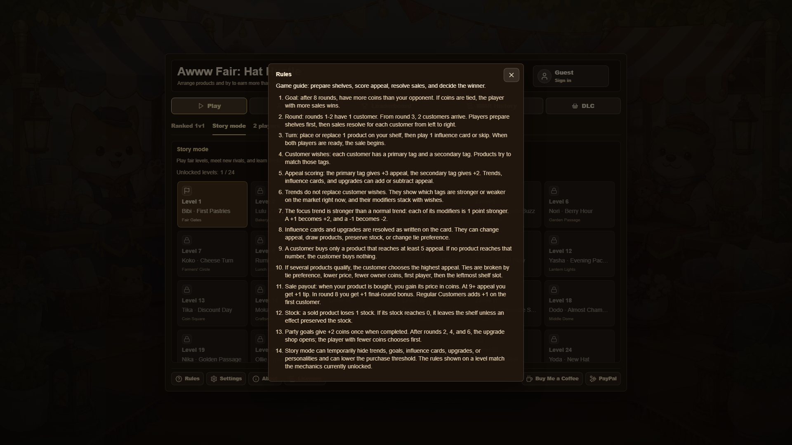
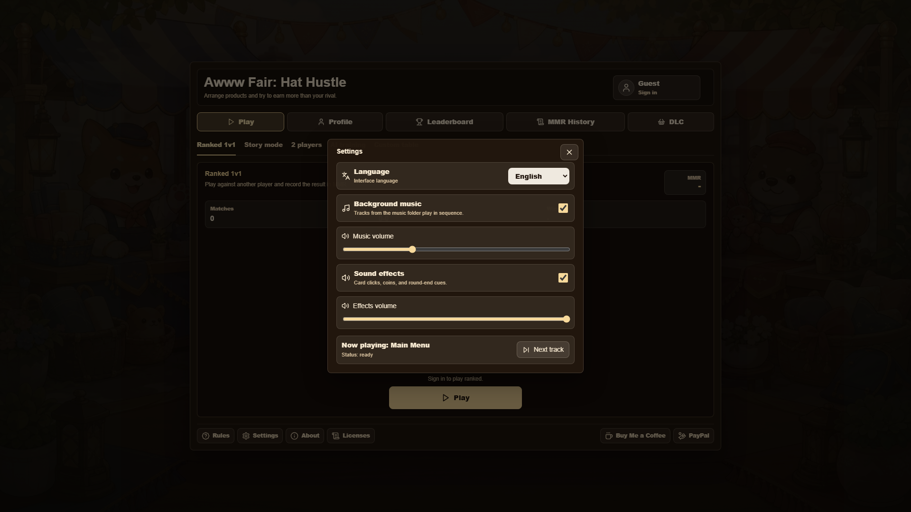
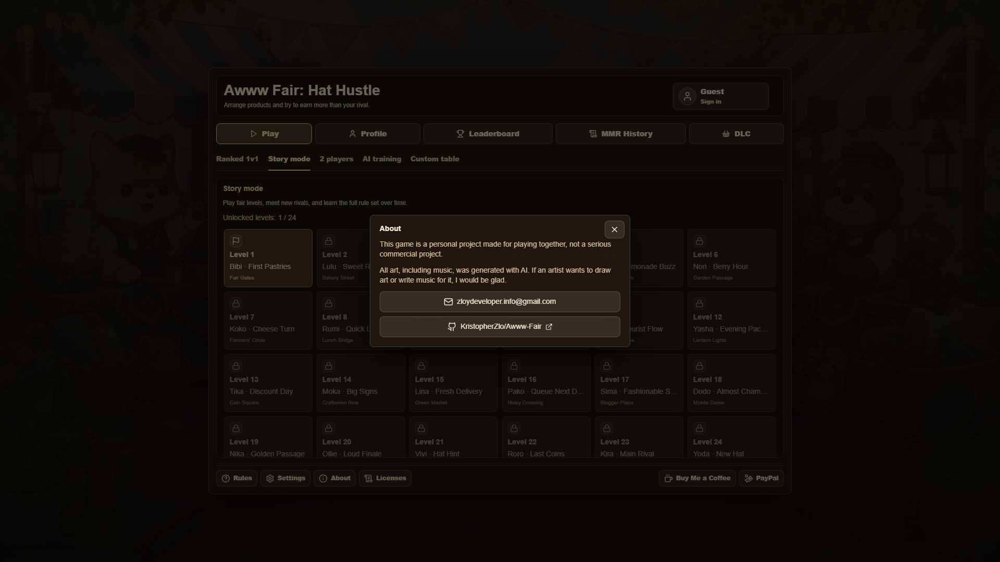

# Awww Fair: Hat Hustle

> [!WARNING]
> This game was made as personal entertainment so I could play it with my girlfriend, not as a serious project.
>
> All art, including music, was generated with AI. If any artist wants to draw art or write music for it, I would be glad.

`Awww Fair: Hat Hustle` is a two-player market tactics game. Players place goods, read customer tags, use influence cards, follow market trends, buy upgrades, and race for coins across 8 rounds.

Win by earning the most coins. If coins are tied, the player with more sales wins.

## Screenshots









## Rules

- A match lasts 8 rounds.
- Rounds 1-2 have 1 customer. From round 3, each round has 2 customers.
- On a turn, a player may place or replace 1 shelf item, then play 1 influence card or pass.
- Each customer has a main tag and a secondary tag.
- A matching main tag gives +3 appeal. A matching secondary tag gives +2 appeal.
- Trends, influence cards, upgrades, and customer traits modify appeal.
- Main trends have stronger modifiers than normal trends.
- A customer buys only an item that reaches the appeal threshold.
- If several items qualify, the item with the highest appeal sells.
- Ties use tie edge, lower price, lower owner coins, first player, then left shelf.
- A sale pays the item's price in coins.
- Appeal 9+ gives +1 tip.
- Round 8 gives +1 final bonus on sales.
- A sold item loses 1 stock. At 0 stock, it leaves the shelf unless an effect saves it.
- Match goals pay a one-time +2 coins.
- Upgrade shops open after rounds 2, 4, and 6. The player with fewer coins picks first.
- Story mode introduces trends, goals, influence cards, upgrades, customer traits, and full sale thresholds over time.

## Modes

- Story campaign: 24 levels.
- Local hotseat.
- Player vs AI.
- Training vs weak AI with hints.
- LAN lobby through a local Node server.
- Ranked 1v1 with accounts, MMR, leaderboard, and match history.

## Technical Notes

The client uses React 18, TypeScript, and Vite. Game rules live in TypeScript modules outside the UI, so tests can run without a browser.

The server handles LAN lobbies, accounts, OAuth, avatars, 2FA, ranked queue, match history, and MMR. Ranked results are settled from event replay, not from a client-submitted final state.

Local progress and local matches use `localStorage`. Shared game events use a replay reducer on the server.

Assets are stored in `public/assets`. Customer resizing lives in `scripts/build-customer-atlases.mjs`.

## Code Layout

- `src/App.tsx` - main UI, menu screens, match screen, profile, settings, and modals.
- `src/game/` - game session, sales, trends, goals, AI, MMR, and ranked replay logic.
- `src/app/` - API paths, auth/ranked/lobby clients, persistence, and UI helpers.
- `src/data/cards.ts` - goods, customers, trends, influence cards, and upgrades.
- `src/styles/` - base, menu, game, modal, cutscene, and responsive CSS.
- `server/` - Node HTTP handlers for auth, lobby, ranked, migrations, XAMPP env, and headers.
- `apache/` - XAMPP Apache reverse proxy config and tests.
- `docs/screenshots/` - README screenshots.

## Development Methods

- TypeScript types for state, cards, events, and server contracts.
- Unit and integration tests with Vitest, Testing Library, and jsdom.
- Regression tests for CSP, XAMPP config, profile, auth, ranked, lobby, and game rules.
- Seeded and replayable match logic for AI, LAN, and ranked checks.
- AI balance checks via `scripts/ai-skill-check.ts`.
- Separate scripts for dev, LAN, XAMPP, migrations, API server, tests, and production build.
- README screenshots rebuilt after UI changes.

## Security

- CSP and browser hardening headers.
- `HttpOnly` session cookies with `SameSite=Lax`.
- SHA-256 session token hashes stored server-side.
- OAuth state cookie for callback validation.
- TOTP 2FA and hashed recovery codes.
- JSON and multipart body size limits.
- Avatar MIME, size, file signature, and storage path checks.
- Path traversal protection for static files and avatars.
- CORS allowlist for lobby origins.
- Lobby join rate limiting, room TTL, and seat timeout.
- Ranked match settlement through server replay.
- Leave cooldown and request size checks for ranked endpoints.
- Apache config proxies API routes apart from static frontend files.

## Commands

```bash
npm install
npm run dev
npm test
npm run build
npm run lobby
npm run db:migrate
npm run lan
npm run xampp:build
npm run xampp:migrate
npm run xampp:api
```

`npm run lan` prints local and LAN URLs. If a default port is busy, it picks the next free port.

## XAMPP LAN Mode

Use this setup when the project is at `E:\xampp\htdocs\trendmarket` and the game must be reachable from other devices on the local network.

1. Start XAMPP MySQL/MariaDB.
2. In `E:\xampp\apache\conf\httpd.conf`, enable `mod_proxy`, `mod_proxy_http`, `mod_alias`, and `mod_headers`.
3. Add this include to Apache config, then restart Apache:

```apache
Include "E:/xampp/htdocs/trendmarket/apache/trendmarket-xampp.conf"
```

4. Copy `.env.xampp.example` to `.env.xampp` if database, LAN URL, or OAuth settings need changes.
5. Build frontend and run migrations:

```bash
npm run xampp:build
npm run xampp:migrate
```

6. Keep the Node API running while Apache serves the game:

```bash
npm run xampp:api
```

Open `http://<LAN-IP>/trendmarket/` from another device. Apache serves the frontend and proxies `/trendmarket/api` plus root `/api` to `127.0.0.1:5176`.

If `/trendmarket/api/...` returns HTTP 503, start `npm run xampp:api`. If login still fails, run `npm run xampp:migrate` and check that XAMPP MySQL/MariaDB is running.

## Ranked Server Env

MariaDB: `MARIADB_HOST`, `MARIADB_PORT`, `MARIADB_USER`, `MARIADB_PASSWORD`, `MARIADB_DATABASE`.

Without `MARIADB_*`, `npm run lan` uses in-memory auth and ranked data for local testing.

OAuth: `APP_BASE_URL`, `GOOGLE_CLIENT_ID`, `GOOGLE_CLIENT_SECRET`, `DISCORD_CLIENT_ID`, `DISCORD_CLIENT_SECRET`.

Local test login is off by default. Set `AUTH_DEV_LOGIN=true` only for short local server tests.
