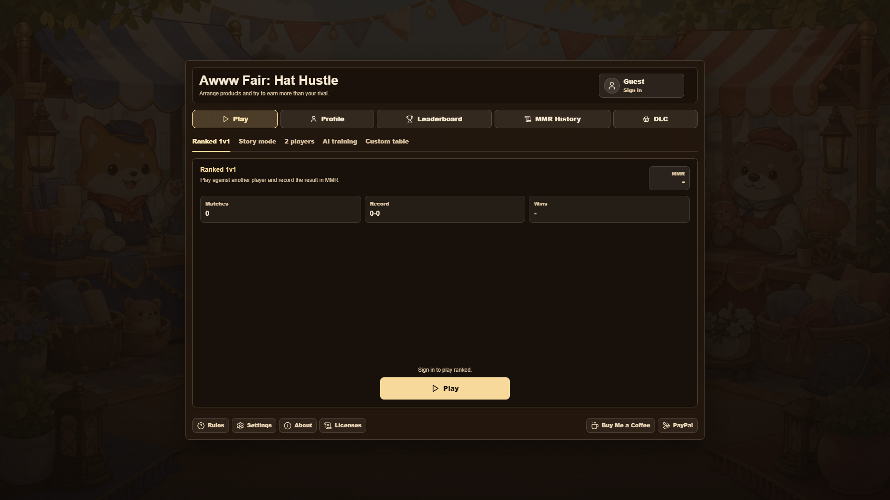
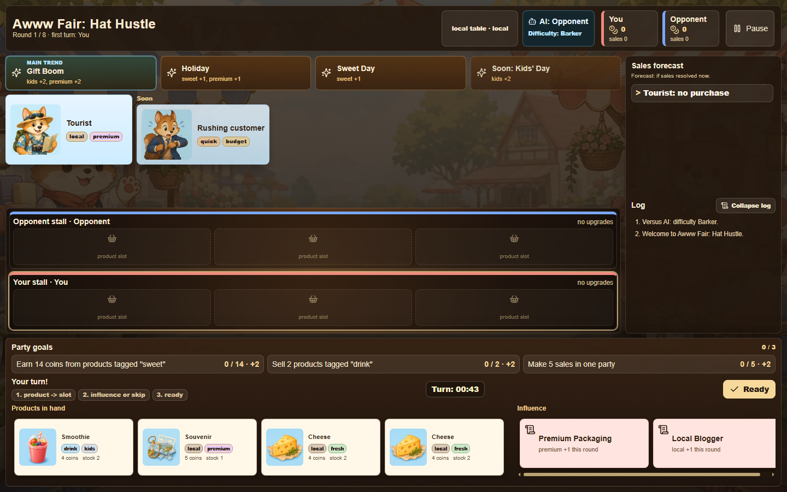

# Awww Fair: Hat Hustle

> [!WARNING]
> This game was made as personal entertainment so I could play it with my girlfriend, not as a serious project.
>
> All art, including music, was generated with AI. If any artist wants to draw art or write music for it, I would be glad.

A cozy competitive market game about earning more than your rival by arranging products, reading customer wishes, and reacting to shifting trends.

## Screenshots





## Game

- Play as rival market stalls across 8-round matches.
- Place products on your shelf and match customer tags to make sales.
- Follow market trends: the main trend is stronger, upcoming trends are previewed.
- Use influence cards to boost your products, weaken rival products, shift tags, or draw better cards.
- Complete party goals for coin bonuses.
- Buy stall upgrades after key rounds.
- Win by money, with sales used as a tiebreaker.

## Modes

- Campaign: 24 levels with gradually unlocked mechanics.
- Local 2-player hotseat.
- Versus AI with selectable difficulty.
- AI training mode.
- LAN lobby play through a local Node server.
- Ranked 1v1 accounts with MMR, leaderboard, and match history.

## Tech

- React 18 + TypeScript.
- Vite for development and production builds.
- Vitest, Testing Library, and jsdom for tests.
- Local game state persistence through `localStorage`.
- Optional TypeScript server for LAN lobbies, auth, MariaDB-backed ranked matches, and replay-checked MMR settlement.
- Generated WebP/PNG atlases for products, customers, cutscenes, music, and sound effects.

## Commands

```bash
npm install
npm run dev
npm test
npm run build
npm run lobby
npm run db:migrate
npm run lan
npm run xampp:build
npm run xampp:migrate
npm run xampp:api
```

`npm run lan` prints the actual local and LAN URLs. If a default dev port is busy, it uses the next available port.

## XAMPP LAN Mode

Use this when the project lives under `E:\xampp\htdocs\trendmarket` and the whole game must be reachable from other devices on the local network.

1. Start XAMPP MySQL/MariaDB.
2. In `E:\xampp\apache\conf\httpd.conf`, make sure `mod_proxy`, `mod_proxy_http`, and `mod_alias` are enabled.
3. Add this include to Apache config, then restart Apache:

```apache
Include "E:/xampp/htdocs/trendmarket/apache/trendmarket-xampp.conf"
```

4. Copy `.env.xampp.example` to `.env.xampp` if you need to change database credentials, LAN URL, or OAuth settings.
5. Build and migrate:

```bash
npm run xampp:build
npm run xampp:migrate
```

6. Keep the Node API running while Apache is serving the game:

```bash
npm run xampp:api
```

Open `http://<LAN-IP>/trendmarket/` from another device. Apache serves the frontend and proxies both `/trendmarket/api` and root `/api` to the local Node server on `127.0.0.1:5176`. The built frontend uses the current public path for API calls, so an app opened from `/trendmarket/` calls `/trendmarket/api/...`. The XAMPP migration command creates the `trend_market` database if it does not exist, then applies the tables.

If `/trendmarket/api/...` returns HTTP 503, Apache is running but the Node API is not available. Start `npm run xampp:api` in a separate terminal and keep it open while playing. If the API starts but login still fails, run `npm run xampp:migrate` and confirm XAMPP MySQL/MariaDB is running.

## Ranked Server Env

MariaDB: `MARIADB_HOST`, `MARIADB_PORT`, `MARIADB_USER`, `MARIADB_PASSWORD`, `MARIADB_DATABASE`.
Without `MARIADB_*` env vars, `npm run lan` uses in-memory auth and ranked data for local testing.

OAuth: `APP_BASE_URL`, `GOOGLE_CLIENT_ID`, `GOOGLE_CLIENT_SECRET`, `DISCORD_CLIENT_ID`, `DISCORD_CLIENT_SECRET`.

Local test login is disabled by default. Set `AUTH_DEV_LOGIN=true` only for short local-only testing sessions when running the server directly.
